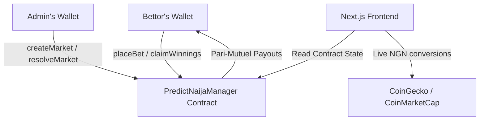

# PredictNaija — Build Summary & Architecture Guide

This document summarizes the complete implementation of **PredictNaija**, a Web3 social prediction market tailored for Nigerian trends and built on the Somnia Blockchain.

---

## 🏗️ 1. Technical Architecture

The project consists of a Solidity smart contract backend and a Next.js 14 Web3 frontend:



---

## 🪙 2. Backend & Smart Contracts
* **Smart Contract**: [`contracts/PredictNaijaManager.sol`](file:///c:/Users/Rokan/Documents/Project/PredictNaija/contracts/PredictNaijaManager.sol)
  * Manages prediction pools dynamically.
  * Calculates payouts using the pari-mutuel formula: 
    $$\text{User Winnings} = \frac{\text{User Stake on Winning Outcome}}{\text{Total Stakes on Winning Outcome}} \times \text{Total Pool}$$
  * Tracks unique users, betting history, claims, and total leaderboard points.
* **Hardhat Configuration**: [`hardhat.config.ts`](file:///c:/Users/Rokan/Documents/Project/PredictNaija/hardhat.config.ts)
  * Compiles Solidity `0.8.24`.
  * Configures connection ports for localhost (`http://127.0.0.1:8545`) and the **Somnia Shannon Testnet** (Chain ID: `50312`).
* **Deployment Scripts**:
  * [`deploy.ts`](file:///c:/Users/Rokan/Documents/Project/PredictNaija/scripts/deploy.ts): Deploys the contract to the active network.
  * [`seedMarkets.ts`](file:///c:/Users/Rokan/Documents/Project/PredictNaija/scripts/seedMarkets.ts): Seeds the initial 6 prediction markets (AFCON, Osimhen, BBNaija eviction, Naira rate, petrol price, Burna Boy).
* **Automated Unit Tests**: [`test/PredictNaija.test.ts`](file:///c:/Users/Rokan/Documents/Project/PredictNaija/test/PredictNaija.test.ts)
  * Verifies contract deployment, market creation authority limits, betting execution, reward calculations, and claim safety constraints.

---

## 🎨 3. Frontend & Design System
* **Premium Light Mode Style**: Replaced the initial dark theme with a clean, light-mode layout tailored with a signature green accent (`#00C853`). Configured in [`globals.css`](file:///c:/Users/Rokan/Documents/Project/PredictNaija/app/globals.css) and [`tailwind.config.ts`](file:///c:/Users/Rokan/Documents/Project/PredictNaija/tailwind.config.ts) using CSS variables.
* **Layout Design**: Wrapped inside a mobile-responsive max-width container (`max-w-md`) with custom glassmorphic panels and simplified navigation.
* **Web3 Integration**: Configured in [`providers.tsx`](file:///c:/Users/Rokan/Documents/Project/PredictNaija/app/providers.tsx) using **Wagmi v2** and **RainbowKit**, allowing seamless connections on both localhost and Somnia Shannon Testnet.
* **Live NGN Rates**: Configured in [`lib/ngnRate.ts`](file:///c:/Users/Rokan/Documents/Project/PredictNaija/lib/ngnRate.ts) to query the latest exchange rate and cache it in `localStorage`. Converts all STT token values to Naira equivalents throughout the interface.

---

## 🔀 4. Complete Route Mapping
* **Feed Route** ([`app/page.tsx`](file:///c:/Users/Rokan/Documents/Project/PredictNaija/app/page.tsx)): Filterable list of Active or Settled prediction pools, displaying real-time pool sizes, outcome ratios, and one-click WhatsApp sharing.
* **Market Detail Route** ([`app/market/[id]/page.tsx`](file:///c:/Users/Rokan/Documents/Project/PredictNaija/app/market/[id]/page.tsx)): Betting slip console that calculates live winnings projections based on stake amounts.
* **My Bets Route** ([`app/my-bets/page.tsx`](file:///c:/Users/Rokan/Documents/Project/PredictNaija/app/my-bets/page.tsx)): Summarizes active predictions and settled wins/losses, containing the claim execution flow.
* **Leaderboard Route** ([`app/leaderboard/page.tsx`](file:///c:/Users/Rokan/Documents/Project/PredictNaija/app/leaderboard/page.tsx)): Rankings of top-performing bettors, highlight pins, and total payouts.
* **Admin Route** ([`app/admin/page.tsx`](file:///c:/Users/Rokan/Documents/Project/PredictNaija/app/admin/page.tsx)): Admin-guarded form to deploy new markets and select winning outcomes to resolve active pools.

---

## 🔏 5. Premium Transaction Modals
Implemented status modals on transaction submissions to improve Web3 UX:
1. **Awaiting Signature**: Prompts wallet interaction.
2. **Blockchain Confirmation**: Displays loaders and a transaction link to the Somnia Shannon block explorer.
3. **Confirmed Success**: Summarizes the outcomes, stakes, and payout details, with options to manually go back to the feed or view predictions.
4. **Transaction Failures**: Safe catches for user cancellations or insufficient funds.

---

## 🛠️ 6. Hydration & Compilation Cleanup
- **Client Hydration Guard**: Implemented mount checks (`mounted` state + hook) on dynamic elements and button labels inside `app/market/[id]/page.tsx`, `app/my-bets/page.tsx`, and `app/admin/page.tsx` to completely resolve Next.js client/server hydration warnings in the browser.
- **Dependency Warning Fix**: Installed the `@react-native-async-storage/async-storage` peer dependency to clear MetaMask SDK module resolve warnings.
- **TS Exclusions**: Configured compiler scope exclusions (`"exclude": ["scripts", "test", "hardhat.config.ts", "typechain-types"]`) in `tsconfig.json` to prevent conflicts between frontend Next.js builds and backend Hardhat configurations.

---

## 🚀 7. How to Run & Settle Locally

### Step 1: Spin up Local Blockchain Node
```bash
npx hardhat node
```

### Step 2: Deploy and Seed Contracts
On a separate terminal, deploy to the local network:
```bash
npx hardhat run scripts/deploy.ts --network localhost
npx hardhat run scripts/seedMarkets.ts --network localhost
```

### Step 3: Run Dev Server
```bash
npm run dev
```
Open **[http://localhost:3000](http://localhost:3000)** in your browser, connect your wallet, and explore!
